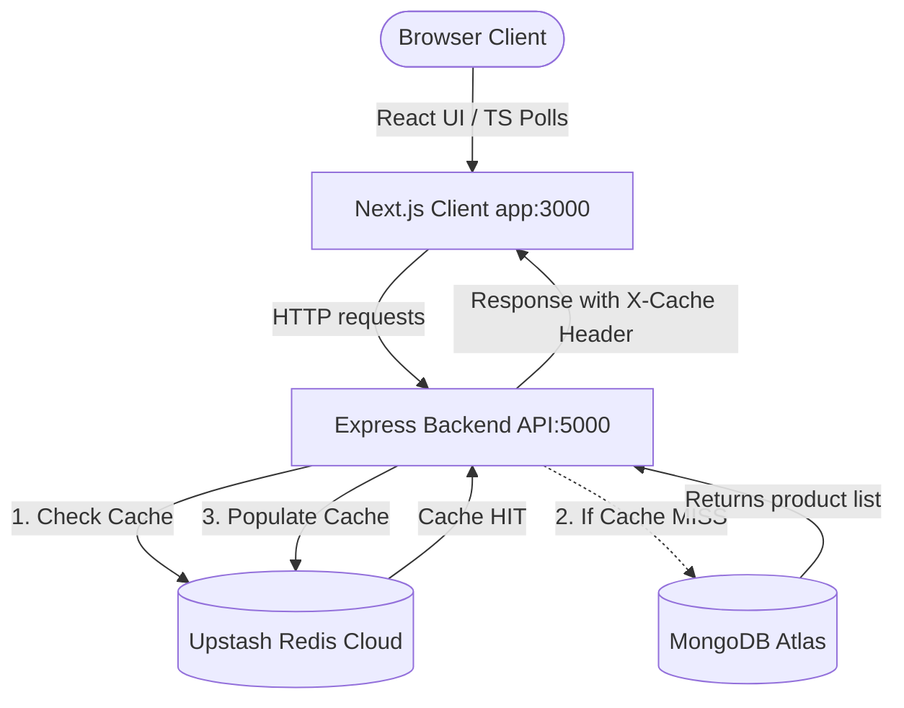

# Neo-Showcase: Product Catalog with Upstash Redis Caching

This workspace contains a high-performance, real-time MERN Stack Product Showcase accelerated by **Upstash Redis** caching and built with **Next.js + TypeScript**.

---

## 🏛️ System Architecture



---

## 🔄 Core Data & Code Flow

### 1. Catalog Request Flow
When a user visits the showcase page or changes category/search filters, the Next.js client triggers a fetch request:

1. **Client Fetch**: `api.getProducts()` calls `GET /api/products?limit=9&category=...`
2. **Backend Cache Interceptor**: 
   - The route is guarded by `routeCache` middleware ([cache.js](file:///d:/Downloads/MERN%20INTERVIEW/webui/product-catalog-backend/src/api/middlewares/cache.js)).
   - It checks Upstash Redis using a versioned cache key: `route:cache:v:<catalogVersion>:<originalUrl>`.
3. **Cache Decision**:
   - **Cache HIT** ⚡: If the key exists, the backend increments cache hits telemetry, sets response header `X-Cache: HIT`, and returns the cached JSON string immediately. **Time taken: ~1-3ms**.
   - **Cache MISS** 🗄️: If the key does not exist, the request continues to `productController` and `productService`.
4. **Database Query**:
   - The backend queries MongoDB Atlas using cursor filters sorted by      `createdAt` descending.
   - It formats the response (including page `nextCursor` calculations).
   - It writes the formatted response to Upstash Redis with a Time-To-Live (TTL) of 5 minutes.
   - It sets response header `X-Cache: MISS` and returns the data. **Time taken: ~30-80ms**.

---

## 📡 Live Feed Synchronization (Automatic Updates)

To keep the showcase in sync automatically when new products are created by other processes or administrators, the frontend implements a polling mechanism:

1. **Active Polling**:
   - A `useEffect` loop in the client [page.tsx](file:///d:/Downloads/MERN%20INTERVIEW/webui/client/app/page.tsx) polls `GET /api/products` (first page, limit 10) every 5 seconds.
2. **New Item Detection**:
   - The client keeps a reactive React state `products` and a reference set `productIdsRef` containing all currently visible product IDs.
   - For every polling response, it filters the fetched products:
     ```typescript
     const newItems = response.items.filter(item => !productIdsRef.current.has(item._id));
     ```
3. **Feed Prepending**:
   - If `newItems` are found, they are prepended at the top of the products feed state:
     ```typescript
     setProducts(prev => [...newItems, ...prev]);
     ```
   - Prepend insertion ensures that they are displayed immediately. A temporary banner notifications toast notifies the user of background additions.
   - A pulsing emerald **NEW** badge highlights items created in the last 15 minutes.

---

## 🛠️ Filtering "New Arrivals"

The showcase provides a **✨ New Arrivals Only** filter checkbox:
- When toggled **ON**, the client filters the current product array to only display products whose `createdAt` timestamp is within the last 24 hours:
  ```typescript
  const oneDayAgo = Date.now() - (24 * 60 * 60 * 1000);
  const displayedProducts = products.filter(p => new Date(p.createdAt).getTime() >= oneDayAgo);
  ```
- When toggled **OFF**, all fetched products are shown.

---

## 📊 Telemetry and Analytics

The backend exposes a metrics route `GET /api/products/metrics/cache` which reads tracking metrics stored in Upstash Redis (hits, misses).
- The Next.js frontend polls this route every 3 seconds to update the **Upstash Cache Dashboard**:
  - **Cache Hit Rate**: The overall efficiency percentage ($\frac{hits}{hits + misses}$).
  - **Status**: The active Redis connection state (e.g. `Redis connected`).
  - **Hits vs Misses**: Comparative counters.

---

## 🚀 Running the Stack

To run both services locally, execute the following commands in separate terminals:

### 1. Run Backend API
```bash
cd product-catalog-backend
npm run dev
```
*Port: `http://localhost:5000`*

### 2. Run Next.js Client
```bash
cd client
npm run dev
```
*Port: `http://localhost:3000`*

### 3. Populating Seed Data
To populate the database with **100 dummy products** and pre-heat the Upstash Cache:
```bash
cd product-catalog-backend
npm run seed
```
